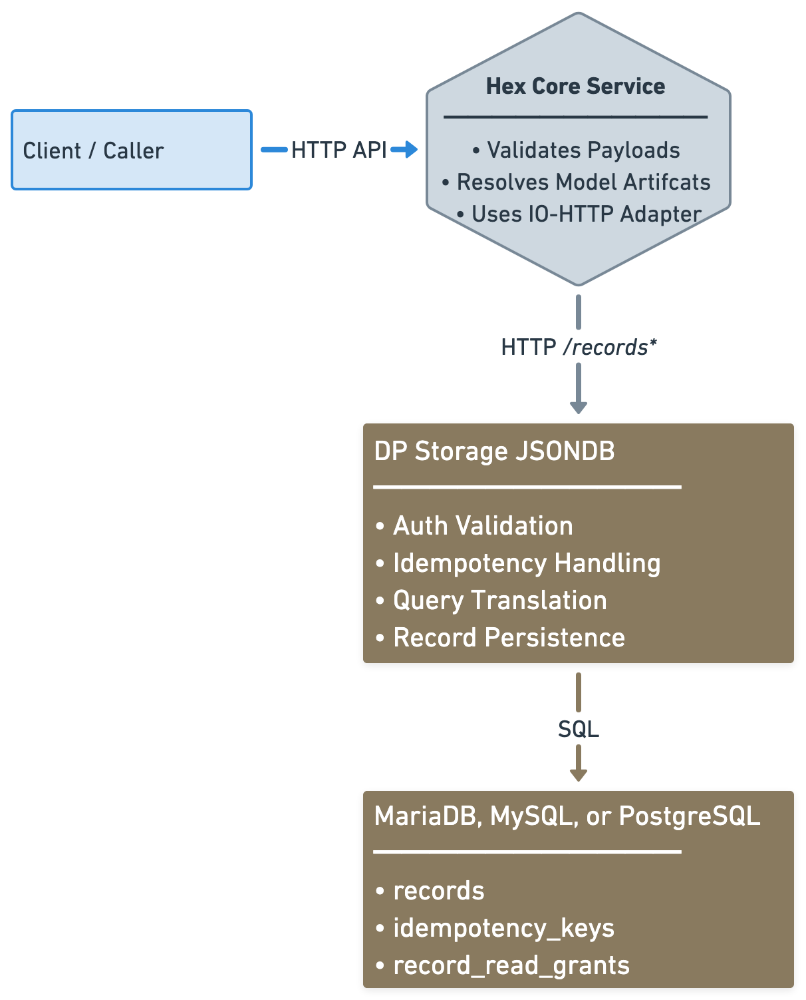

# CE-RISE DP Storage JSONDB Service

[](https://doi.org/10.5281/zenodo.18984410)

A Rust-based storage backend service for CE-RISE `hex-core-service` that persists and retrieves full digital-passport-like records through a simple HTTP contract.

This is a separate deployable microservice used by `hex-core-service` through its `io-http` adapter. It keeps persistence concerns isolated from the core orchestration layer, stores complete record payloads as JSON documents, and relies on MariaDB, MySQL, or PostgreSQL as the backing store.

**Documentation:** [https://ce-rise-software.codeberg.page/dp-storage-jsondb-service/](https://ce-rise-software.codeberg.page/dp-storage-jsondb-service/)

---

## What This Project Provides

- Source code for the `dp-storage-jsondb` HTTP backend.
- Containerized service image for deployment.
- Runtime-compatible backend for the `hex-core-service` `io-http` adapter.

## Architecture View

### Storage Interaction View



This backend is called by `hex-core-service`, not directly by end users in the primary deployment model.

## Service Container

### Pull Image

```bash
docker pull rg.fr-par.scw.cloud/ce-rise-software/dp-storage-jsondb:<tag>
```

Use an explicit version tag such as `v0.0.1` for stable deployments.

### Start Container

```bash
docker run --rm -p 8080:8080 \
  -e SERVER_HOST=0.0.0.0 \
  -e SERVER_PORT=8080 \
  -e DB_BACKEND=postgres \
  -e DB_HOST="<db-host>" \
  -e DB_PORT=5432 \
  -e DB_NAME="dp_storage" \
  -e DB_USER="dp_storage" \
  -e DB_PASSWORD="<db-password>" \
  -e DB_POOL_SIZE=10 \
  -e DB_TIMEOUT_MS=5000 \
  -e AUTH_MODE=jwt_jwks \
  -e AUTH_JWKS_URL="https://<idp>/realms/<realm>/protocol/openid-connect/certs" \
  -e AUTH_ISSUER="https://<idp>/realms/<realm>" \
  -e AUTH_AUDIENCE="hex-core-service" \
  rg.fr-par.scw.cloud/ce-rise-software/dp-storage-jsondb:<tag>
```

### Required Runtime Parameters

| Variable | Required | Description |
|---|---|---|
| `SERVER_HOST` | Yes | Bind host for the HTTP service |
| `SERVER_PORT` | Yes | Bind port for the HTTP service |
| `DB_BACKEND` | Yes | Database backend (`mysql`, `mariadb`, or `postgres`) |
| `DB_HOST` | Yes | Database host |
| `DB_PORT` | Yes | Database port |
| `DB_NAME` | Yes | Database name |
| `DB_USER` | Yes | Database user |
| `DB_PASSWORD` | Yes | Database password |
| `DB_POOL_SIZE` | Yes | Database pool size |
| `DB_TIMEOUT_MS` | Yes | Database connection/query timeout |
| `AUTH_MODE` | Yes | Authentication mode (`jwt_jwks` or `disabled`) |
| `AUTH_JWKS_URL` | Yes for `jwt_jwks` | JWKS endpoint URL |
| `AUTH_ISSUER` | Yes for `jwt_jwks` | Expected token issuer |
| `AUTH_AUDIENCE` | Yes for `jwt_jwks` | Expected token audience |

## Compose Deployment

Use one of the canonical deployment files depending on the supported SQL backend:

- [docker-compose.mysql.yml](/home/riccardo/code/CE-RISE-software/dp-storage-jsondb-service/docker-compose.mysql.yml)
- [docker-compose.mariadb.yml](/home/riccardo/code/CE-RISE-software/dp-storage-jsondb-service/docker-compose.mariadb.yml)
- [docker-compose.postgres.yml](/home/riccardo/code/CE-RISE-software/dp-storage-jsondb-service/docker-compose.postgres.yml)

These compose files are deployment-oriented. Local DB test fixtures are kept under `scripts/`.

## Local Testing

Run the normal Rust test suite:

```bash
cargo test
```

Run the live database integration test locally:

```bash
bash scripts/test-mysql.sh
bash scripts/test-mariadb.sh
bash scripts/test-postgres.sh
```

## Contributing

This repository is maintained on Codeberg. The GitHub repository is a mirror for release and archival workflows.


---

<a href="https://europa.eu" target="_blank" rel="noopener noreferrer">
  
</a>

Funded by the European Union under Grant Agreement No. 101092281 — CE-RISE.  
Views and opinions expressed are those of the author(s) only and do not necessarily reflect those of the European Union or the granting authority (HADEA).
Neither the European Union nor the granting authority can be held responsible for them.

© 2026 CE-RISE consortium.  
Licensed under the [European Union Public Licence v1.2 (EUPL-1.2)](LICENSE).  
Attribution: CE-RISE project (Grant Agreement No. 101092281) and the individual authors/partners as indicated.

<a href="https://www.nilu.com" target="_blank" rel="noopener noreferrer">
  
</a>

Developed by NILU (Riccardo Boero — ribo@nilu.no) within the CE-RISE project.
