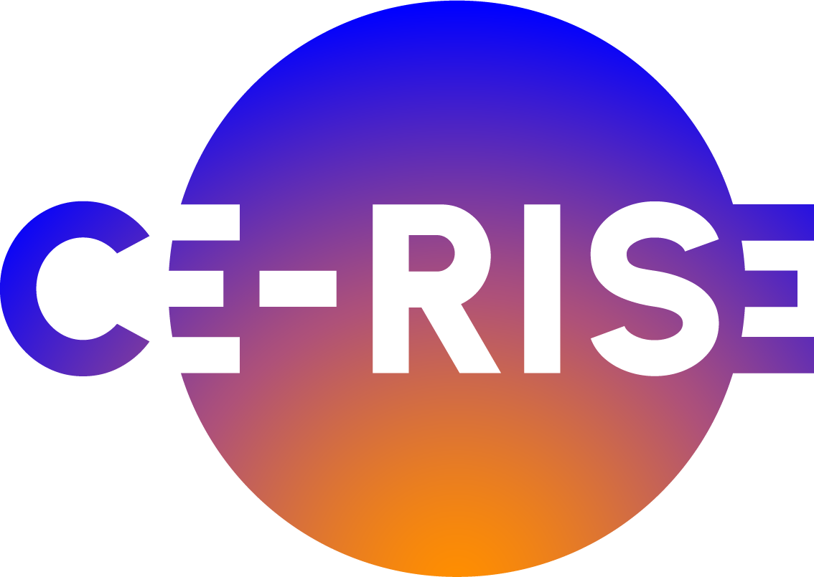

# CE-RISE DP Storage JSONDB Service

This site contains the technical documentation for the CE-RISE `dp-storage-jsondb`.

`dp-storage-jsondb` is a standalone HTTP storage backend used by `hex-core-service` through the `io-http` adapter. Its job is deliberately narrow: persist records, retrieve records, evaluate storage-side queries, enforce storage-side access checks, and expose operational endpoints for health, readiness, and API description.

This service does not perform model resolution, payload validation, or orchestration of business workflows. Those responsibilities remain in `hex-core-service`.

## What This Service Does

- Accepts the backend HTTP contract expected by `hex-core-service`
- Stores full record payloads as JSON documents
- Supports MariaDB, MySQL, and PostgreSQL
- Enforces bearer-token authentication in normal operation
- Applies idempotency protection for record creation
- Evaluates canonical record queries, including JSON payload paths
- Exposes operational endpoints for health and readiness

## Where It Sits In The CE-RISE Stack

In the primary deployment model, callers do not interact with this service directly. They call `hex-core-service`, and `hex-core-service` calls this backend.

## Supported Database Backends

The current implementation supports:

- MySQL
- MariaDB
- PostgreSQL

All three backends are exercised by local live-database integration tests.

## Documentation Guide

Use the navigation sidebar to access the main topics:

- Architecture and service boundaries
- HTTP contract and endpoint behavior
- Authentication and authorization behavior
- Query language and payload field paths
- Runtime configuration
- Deployment options for each supported database
- Backend-specific notes
- Testing strategy and local integration scripts
- Operational behavior and troubleshooting

## First Steps

If you are new to this service, read the pages in this order:

1. `Architecture`
2. `HTTP Contract`
3. `Configuration`
4. `Deployment`
5. `Operations`

---

Funded by the European Union under Grant Agreement No. 101092281 — CE-RISE.  
Views and opinions expressed are those of the author(s) only and do not necessarily reflect those of the European Union or the granting authority (HADEA).
Neither the European Union nor the granting authority can be held responsible for them.

© 2026 CE-RISE consortium.  
Licensed under the [European Union Public Licence v1.2 (EUPL-1.2)](https://joinup.ec.europa.eu/collection/eupl/eupl-text-eupl-12).  
Attribution: CE-RISE project (Grant Agreement No. 101092281) and the individual authors/partners as indicated.

Developed by NILU (Riccardo Boero — ribo@nilu.no) within the CE-RISE project.
